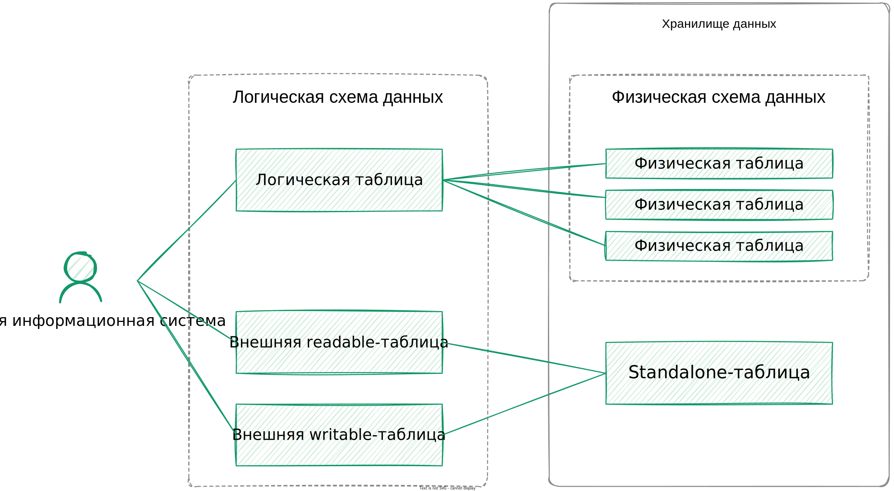

---
layout: default
title: Standalone-таблица
nav_order: 6.5
parent: Основные понятия
grand_parent: Обзор понятий, компонентов и связей
has_children: false
has_toc: false
---

# Standalone-таблица {#standalone_table}

_Standalone-таблица_ — таблица СУБД хранилища, расположенная вне [физической схемы данных](../physical_schema/physical_schema.md).

Данные standalone-таблиц можно читать и записывать через систему, используя 
единый [синтаксис SQL+](../../../reference/sql_plus_requests/sql_plus_requests.md) для всех СУБД. 
Чтение и запись выполняются через проекции — внешние таблицы. 
Данные можно читать через внешние [readable-таблицы](../external_table/external_table.md#readable_table), 
записывать — через внешние [writable-таблицы](../external_table/external_table.md#writable_table).

{: .figure-center}
*Связи standalone-таблицы с внешними таблицами*
{: .figure-caption-center}

Внешняя таблица может быть связана с существующей standalone-таблицей. Если standalone-таблица отсутствует, 
она может быть автоматически создана при создании внешней таблицы.

В зависимости от набора внешних таблиц проекция standalone-таблицы в системе может быть:
* полной и включать возможности чтения и записи,
* частичной и включать возможность только записи или только чтения.

Для данных standalone-таблицы, полностью спроецированной в систему, доступны те же действия, что и для данных 
[логических таблиц](../logical_table/logical_table.md):
* [загрузка данных](../../../working_with_system/data_upload/data_upload.md),
* [обновление данных](../../../working_with_system/data_update/data_update.md),
* [чтение данных](../../../working_with_system/data_reading/data_reading.md),
* [выгрузка данных](../../../working_with_system/data_download/data_download.md).

Для частично спроецированной таблицы доступны либо загрузка и обновление, либо выгрузка и чтение.

Для standalone-таблиц действуют все ограничения той СУБД, в которых эти таблицы находятся. Подробнее об ограничениях
системы и отдельных СУБД см. в разделе [Ограничения системы](../../../restrictions/restrictions.md).

В отличие от данных логических таблиц, данные standalone-таблиц не версионируются: каждая новая версия записи заменяет
предыдущую, и история изменений не сохраняется. Изменения в данные standalone-таблицы вносятся вне механизма 
[дельт](../delta/delta.md) и [операций записи](../write_operation/write_operation.md).
{: .note-wrapper}

Данные standalone-таблицы можно добавить в логическую таблицу с помощью запроса
[INSERT SELECT](../../../reference/sql_plus_requests/INSERT_SELECT/INSERT_SELECT.md). Это позволит использовать
преимущества логических таблиц: иметь доступ к истории изменений данных, а также изменять данные без использования
внешних readable-таблиц и writable-таблиц. В некоторых случаях это также позволит обойти ограничения, связанные с
конкретной СУБД.
{: .note-wrapper}

Чтобы standalone-таблицу можно было спроецировать в систему, она должна располагаться:
* в той же физической базе данных, где хранятся данные связанной [логической базы данных](../logical_db/logical_db.md), 
  — если таблица находится в ADB или ADP;
* в том же кластере, где хранятся данные связанной логической базы данных, — если таблица находится в ADQM или ADG.