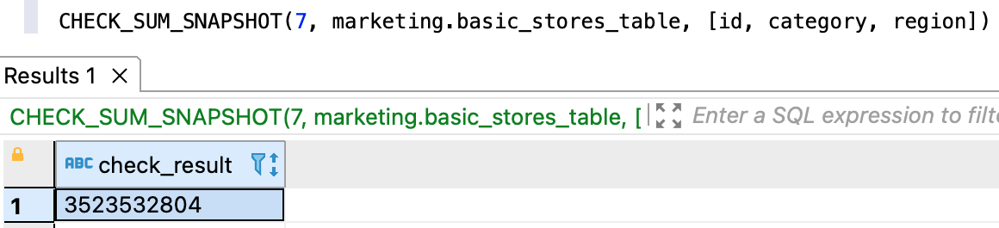
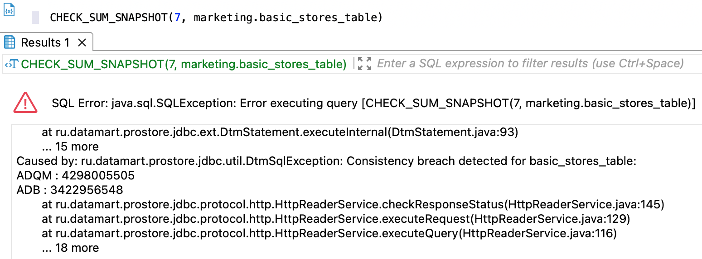

# CHECK_SUM_SNAPSHOT
{: .no_toc }

<details markdown="block">
  <summary>
    Содержание раздела
  </summary>
  {: .text-delta }
1. TOC
{:toc}
</details>

Запрос позволяет рассчитать контрольную сумму актуальных данных на момент закрытия указанной 
[дельты](../../../overview/main_concepts/delta/delta.md).

Запрос поддерживается для ADB, ADQM и ADP.
{: .note-wrapper}

Контрольную сумму можно рассчитать по следующим данным:
*   отдельным столбцам [логической таблицы](../../../overview/main_concepts/logical_table/logical_table.md) или 
    [материализованного представления](../../../overview/main_concepts/materialized_view/materialized_view.md),
*   всем столбцам логической таблицы или материализованного представления,
*   всем логическим таблицам [логической базы данных](../../../overview/main_concepts/logical_db/logical_db.md).

Контрольная сумма рассчитывается по каждой [СУБД](../../../introduction/supported_DBMS/supported_DBMS.md)
[хранилища](../../../overview/main_concepts/data_storage/data_storage.md),
которая хранит данные проверяемой логической сущности. Порядок расчета описан 
[ниже](#checksum_algorithms).

При расчете контрольной суммы по отдельным столбцам рекомендуется добавлять первичный ключ в список столбцов. Это повысит 
уникальность контрольных сумм, рассчитываемых по разным данных.
{: .tip-wrapper}

Чтобы рассчитать контрольную сумму по изменениям данных, а не актуальным данным, используйте запрос 
[CHECK_SUM](../CHECK_SUM/CHECK_SUM.md).
{: .tip-wrapper}

В ответе возвращается:
*   объект ResultSet с контрольной суммой при успешном выполнении запроса и отсутствии расхождений между СУБД хранилища;
*   исключение при наличии расхождений или неуспешном выполнении запроса.

Если контрольные суммы различаются между СУБД хранилища, система возвращает исключение
`Consistency breach detected for <entity_name>`. Исключение содержит список контрольных сумм по всем проверенным СУБД. 
При расчете контрольной суммы по логической базе данных система возвращает исключение по первому найденному расхождению и 
не проверяет следующие сущности.

Значения типа FLOAT и DOUBLE могут иметь разные контрольные суммы из-за разницы в точности типов. Чтобы избежать 
расхождения в контрольных суммах, используйте для всех значений с плавающей точкой тип 
DOUBLE (как более распространенный среди СУБД) или исключайте столбцы типа FLOAT и DOUBLE из запросов `CHECK_SUM_SNAPSHOT`.
{: .note-wrapper}

## Синтаксис {#syntax}

```sql
CHECK_SUM_SNAPSHOT(delta_num[, normalization][, [db_name.]entity_name[, square_bracketed_column_list]])
```

**Параметры:**

`delta_num`

: Номер дельты, на момент закрытия которой рассчитывается контрольная сумма актуальных данных.

`normalization`
: Опциональный коэффициент, который повышает лимит на количество проверяемых записей в одной сущности, 
  но снижает уникальность контрольных сумм. Может принимать любое целое значение, начиная с 1. Значение по умолчанию — 1.
  <br>Если коэффициент не указан или равен 1, проверяемая сущность может содержать до `4'294'967'298` актуальных записей 
  в дельте; при увеличении коэффициента лимит увеличивается пропорционально.

`db_name`

: Имя логической базы данных, которой принадлежит проверяемая сущность. Опционально, если
  выбрана логическая БД, [используемая по умолчанию](../../../working_with_system/other_features/default_db_set-up/default_db_set-up.md).

`entity_name`

: Имя логической таблицы или материализованного представления, по которому 
  рассчитывается контрольная сумма. Опциональный параметр.

`square_bracketed_column_list`

: Опциональный список имен столбцов, по которым рассчитывается контрольная сумма. 
  Элементы списка перечисляются в квадратных скобках через запятую.
  <br>Если столбцы не указаны, система рассчитывает контрольную сумму по всем столбцам таблицы или представления.

## Ограничения {#restrictions}

* Контрольная сумма логической базы данных рассчитывается только по данным логических таблиц и не учитывает данные 
  материализованных представлений.
* Существует вероятность совпадения контрольных сумм для разных наборов данных.
* Количество проверяемых записей в одной сущности ограничено и регулируется коэффициентом нормализации. Если количество 
  актуальных записей какой-либо сущности в указанной дельте больше `4'294'967'298`, нужно подобрать подходящее значение 
  коэффициента нормализации.

## Примеры {#examples}

### Запрос по отдельным столбцам логической таблицы {#columns_example}

Расчет контрольной суммы по трем столбцам таблицы `basic_stores_table` в седьмой дельте:
```sql
CHECK_SUM_SNAPSHOT(7,sales.basic_stores_table,[id, category, region])
```

На рисунке ниже показан пример ответа на запрос `CHECK_SUM_SNAPSHOT` с перечислением столбцов таблицы.

{:height="80%" width="80%"}
{: .figure-center}
*Ответ CHECK_SUM_SNAPSHOT по отдельным столбцам таблицы*
{: .figure-caption-center}

### Запрос по всем столбцам логической таблицы {#table_example}

Расчет контрольной суммы по всей таблице `basic_stores_table` в седьмой дельте:
```sql
CHECK_SUM_SNAPSHOT(7,sales.basic_stores_table)
```

На рисунке ниже показан пример ответа на запрос `CHECK_SUM_SNAPSHOT` по логической таблице при наличии расхождений.

{:height="90%" width="90%"}
{: .figure-center}
*Ответ CHECK_SUM_SNAPSHOT по логической таблице при наличии расхождений*
{: .figure-caption-center}

### Запрос по всем столбцам материализованного представления {#matview_example}

Расчет контрольной суммы по всему материализованному представлению `sales_by_stores` в седьмой дельте:
```sql
CHECK_SUM_SNAPSHOT(7,sales.sales_by_stores)
```

### Запрос по логической базе данных {#db_example}

Расчет контрольной суммы по всем таблицам логической базы данных `sales_new` в нулевой дельте:
```sql
-- выбор логической базы данных sales_new в качестве базы данных по умолчанию
USE sales_new;

-- расчет контрольной суммы логической БД
CHECK_SUM_SNAPSHOT(0);
```

На рисунке ниже показан пример ответа на запрос `CHECK_SUM_SNAPSHOT` по логической базе данных.

{:height="26%" width="26%"}
{: .figure-center}
*Ответ CHECK_SUM_SNAPSHOT по логической базе данных*
{: .figure-caption-center}

### Запрос по логической базе данных с коэффициентом нормализации {#example_with_normalization}

Расчет контрольной суммы по всем таблицам логической базы данных `sales_new` с коэффициентом нормализации, равным 100:
```sql
-- выбор логической базы данных sales в качестве базы данных по умолчанию
USE sales_new;

-- расчет контрольной суммы логической БД с указанным коэффициентом нормализации
CHECK_SUM_SNAPSHOT(7, 100);
```

На рисунке ниже показан пример ответа на такой запрос.

{:height="26%" width="26%"}
{: .figure-center}
*Запрос CHECK_SUM_SNAPSHOT с коэффициентом нормализации*
{: .figure-caption-center}

## Порядок расчета контрольных сумм {#checksum_algorithms}

### Расчет контрольной суммы по логической таблице или материализованному представлению {#algorithm_for_table}

Контрольная сумма логической таблицы или материализованного представления рассчитывается, 
[как описано в разделе CHECK_DATA](../CHECK_DATA/CHECK_DATA.md#checksum), с тем отличием, что контрольные суммы в шаге 1
рассчитываются не по записям, загруженным в дельте, а записям, актуальным на момент закрытия дельты.

### Расчет контрольной суммы по логической базе данных {#algorithm_for_db}

Контрольная сумма логической базы данных рассчитывается так:
1. По каждой логической таблице логической базы данных рассчитывается контрольная сумма (см. 
   [выше](#algorithm_for_table)).
2. Контрольные суммы всех логических таблиц суммируются — получается 64-битная контрольная сумма 
   логической базы данных.