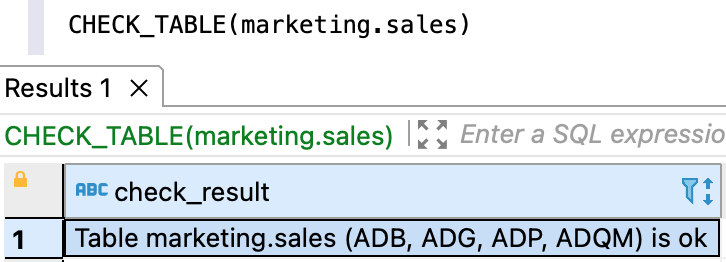
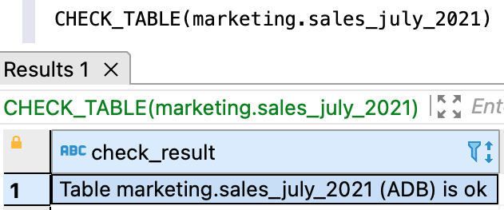
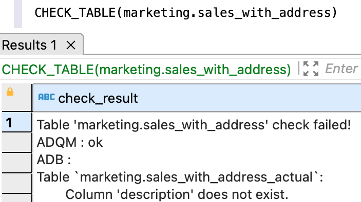
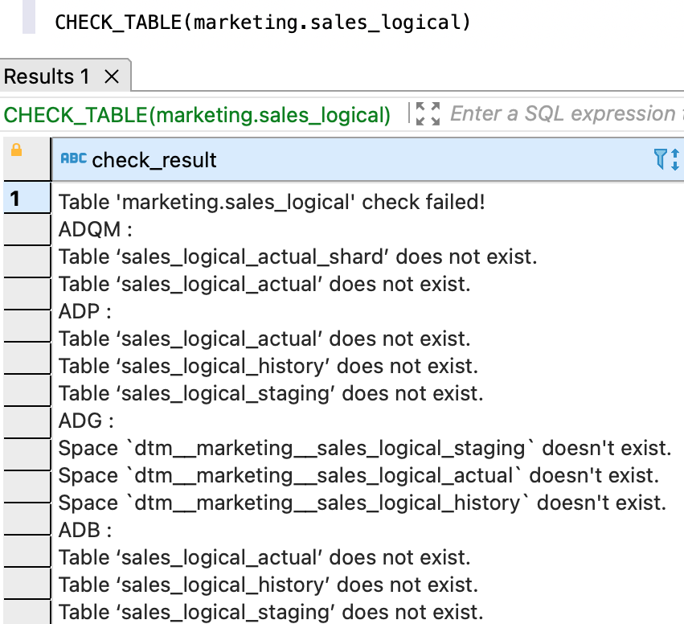

---
layout: default
title: CHECK_TABLE
nav_order: 9
parent: Запросы SQL+
grand_parent: Справочная информация
has_children: false
has_toc: false
---

# CHECK_TABLE
{: .no_toc }

<details markdown="block">
  <summary>
    Содержание раздела
  </summary>
  {: .text-delta }
1. TOC
{:toc}
</details>

Запрос позволяет проверить соответствие [логической таблицы](../../../overview/main_concepts/logical_table/logical_table.md) 
и ее физических представлений — [физических таблиц](../../../overview/main_concepts/physical_table/physical_table.md) 
в [хранилище данных](../../../overview/main_concepts/data_storage/data_storage.md).

В проверке участвуют указанная логическая таблица и все связанные с ней физические таблицы. Если СУБД 
хранилища не хранит данные логической таблицы, и, следовательно, не содержит связанные физические таблицы, 
она пропускается при проверке.

Проверяется соответствие следующих элементов:
*   имен столбцов,
*   типов данных столбцов,
*   первичного ключа.

Имена проверяются для всех столбцов логической и физических таблиц, включая служебные 
столбцы, имеющиеся только у физических таблиц. Например, если служебный столбец `sys_to` удален из 
физической таблицы, в ответе вернется сообщение о расхождении.

В ответе возвращается:
*   объект ResultSet с одной записью, содержащей результаты проверки, при успешном выполнении запроса;
*   исключение при неуспешном выполнении запроса.

Возвращаемая информация включает сообщение об успешной проверке или найденных расхождениях, а также список 
проверенных СУБД хранилища. Примеры запросов и ответов см. в секции [Примеры](#examples).

## Синтаксис {#syntax}

```sql
CHECK_TABLE([db_name.]table_name)
```

Параметры:
*   `db_name` — имя логической базы данных, которой принадлежит проверяемая логическая таблица. 
    Указывается опционально, если выбрана логическая БД, [используемая по умолчанию](../../../working_with_system/other_features/default_db_set-up/default_db_set-up.md);
*   `table_name` — имя проверяемой логической таблицы.

## Примеры {#examples}

Проверка логической таблицы `sales`:
```sql
CHECK_TABLE(marketing.sales)
```

### Ответ при успешной проверке {#success_examples}

На рисунках ниже показаны примеры ответов в случае успешной проверки: на первом рисунке — по таблице,
данные которой размещены во всех СУБД хранилища, на втором — по таблице, данные которой размещены только в ADB.

{:height="50%" width="50%"}
{: .figure-center}
*Ответ CHECK_TABLE при успешной проверке*
{: .figure-caption-center}

{:height="44%" width="44%"}
{: .figure-center}
*Ответ CHECK_TABLE с проверкой только в ADB*
{: .figure-caption-center}

### Ответ при наличии расхождений {#failure_examples}

На рисунке ниже показан пример ответа при наличии расхождений, которые вызваны тем, что в физической таблице 
ADB отсутствует столбец `description`.

{:height="50%" width="50%"}
{: .figure-center}
*Ответ CHECK_TABLE с найденными расхождениями*
{: .figure-caption-center}

На рисунке ниже показан пример ответа при наличии расхождений, которые вызваны тем, что 
логическая таблица была создана только на логическом уровне. Подробнее 
о создании и пересоздании логической таблицы на логическом уровне см. в разделе 
[CREATE TABLE](../../../reference/sql_plus_requests/CREATE_TABLE/CREATE_TABLE.md#logical_only).

{:height="60%" width="60%"}
{: .figure-center}
*Ответ CHECK_TABLE с найденными расхождениями*
{: .figure-caption-center}