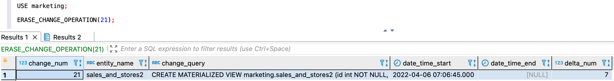

---
layout: default
title: ERASE_CHANGE_OPERATION
nav_order: 27.5
parent: Запросы SQL+
grand_parent: Справочная информация
has_children: false
has_toc: false
---

# ERASE_CHANGE_OPERATION

Запрос отменяет текущую незавершенную операцию по изменению [логической схемы данных](../../../overview/main_concepts/logical_schema/logical_schema.md). 
Это может быть полезно, например, если операция зависла.

Успешный ответ содержит ResultSet с одной строкой, в которой представлена информация об отмененной операции.
Неуспешный ответ содержит исключение. Если незавершенной операции с указанным номером нет, система возвращает исключение
`Active operation does not exist`.

При успешном выполнении запроса текущая операция отменяется и запись о ней удаляется из
[журнала](../../../overview/main_concepts/changelog/changelog.md).
По отмененной операции возвращается следующая информация:
* `change_num` — номер операции. Нумерация ведется в рамках 
  [логической базы данных](../../../overview/main_concepts/logical_db/logical_db.md);
* `entity_name` — имя логической сущности;
* `change_query` — содержимое запроса на изменение логической сущности;
* `date_time_start` — дата и время начала выполнения запроса `change_query`;
* `date_time_end` — дата и время окончания выполнения запроса `change_query`. Для текущей операции значение равно `NULL`;
* `delta_num` — последняя закрытая дельта в логической базе данных на момент отмены операции. Если закрытых дельт еще 
  нет, значение равно `NULL`.

## Синтаксис {#syntax}

```sql
ERASE_CHANGE_OPERATION(change_num[, db_name]) 
```

**Параметры:**

`change_num`

: Номер операции по изменению логической схемы данных. Номера всех операций можно получить с помощью запроса 
  [GET_CHANGES](../GET_CHANGES/GET_CHANGES.md).

`db_name`

: Имя логической базы данных, к которой относится операция. Опционально, если выбрана логическая БД, 
  [используемая по умолчанию](../../../working_with_system/other_features/default_db_set-up/default_db_set-up.md).

## Примеры {#examples}

Отмена операции в указанной логической базе данных:

```sql
ERASE_CHANGE_OPERATION(28, sales)
```

Отмена операции в логической базы данных, выбранной по умолчанию:

```sql
-- выбор логической базы данных sales в качестве базы данных по умолчанию
USE sales;

-- запрос журнала для sales
ERASE_CHANGE_OPERATION(28);
```

На рисунке ниже показан пример успешного ответа на запрос `ERASE_CHANGE_OPERATION`.


{: .figure-center}
*Ответ ERASE_CHANGE_OPERATION*
{: .figure-caption-center}