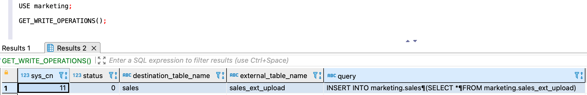

---
layout: default
title: GET_WRITE_OPERATIONS
nav_order: 34
parent: Запросы SQL+
grand_parent: Справочная информация
has_children: false
has_toc: false
---

# GET_WRITE_OPERATIONS

Запрос возвращает информацию о незавершенных 
[операциях записи](../../../overview/main_concepts/write_operation/write_operation.md) горячей 
[дельты](../../../overview/main_concepts/delta/delta.md). 

Под незавершенными понимаются операции со статусами 
«Выполняется» и «Отменяется». Подробнее о возможных статусах операций см. в разделе 
[Операция записи](../../../overview/main_concepts/write_operation/write_operation.md#write_operation_statuses).

Перед выполнением запроса необходимо выбрать логическую базу данных, 
[используемую по умолчанию](../../../working_with_system/other_features/default_db_set-up/default_db_set-up.md), 
если она еще не выбрана.
{: .note-wrapper}

Успешный ответ содержит объект ResultSet, где каждая строка соответствует одной операции. Неуспешный ответ содержит
исключение.

При успешном ответе по каждой операции возвращается следующая информация:
* `sys_cn` — номер операции записи;
* `status` — статус операции записи. Возможные значения: 0 — выполняется, 2 — отменяется;
* `destination_table_name` — имя таблицы-приемника данных;
* `external_table_name` — имя [внешней таблицы](../../../overview/main_concepts/external_table/external_table.md) 
  загрузки, которая участвовала в операции. Значение отсутствует, если внешняя таблица не участвовала в операции 
  (например, операция была запущена запросом [обновления данных](../../../working_with_system/data_update/data_update.md));
* `query` — исходный запрос операции записи.

Незавершенную операцию записи можно перезапустить или отменить. Подробнее о способах обработки незавершенных операций 
см. в разделе [Управление операциями записи](../../../working_with_system/operation_management/write_op_management/write_op_management.md).
{: .tip-wrapper}
  
## Синтаксис {#syntax}

```sql
GET_WRITE_OPERATIONS()
```

На рисунке ниже показан пример ответа с одной операцией в статусе «Выполняется». 
Операция запущена запросом [INSERT SELECT FROM upload_external_table](../INSERT_SELECT_FROM_upload_external_table/INSERT_SELECT_FROM_upload_external_table.md), который 
загружает данные в логическую таблицу `sales` с использованием внешней таблицы загрузки `sales_ext_upload`.


{: .figure-center}
*Пример ответа на запрос GET_WRITE_OPERATIONS*
{: .figure-caption-center}