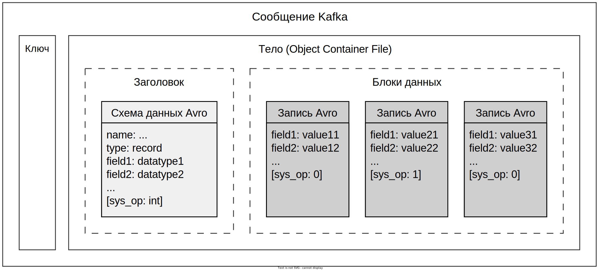

---
layout: default
title: Формат загрузки данных
nav_order: 4
parent: Справочная информация
has_children: false
has_toc: false
---

# Формат загрузки данных {#upload_format}
{: .no_toc }

<details markdown="block">
  <summary>
    Содержание раздела
  </summary>
  {: .text-delta }
1. TOC
{:toc}
</details>

## Структура сообщений {#message_structure}

Данные [загружаются](../../working_with_system/data_upload/data_upload.md) в систему в виде сообщений топиков Kafka. 
Каждое сообщение имеет структуру, показанную на рисунке ниже.


{: .figure-center}
*Структура загружаемых сообщений*
{: .figure-caption-center}

## Формат данных {#data_format}

Для успешной загрузки данные должны соответствовать следующим условиям:
* Данные представлены в виде сообщений топика Kafka.
* Каждое сообщение состоит из ключа и тела. Требования к ключу сообщения не предъявляются.
* Тело сообщения представляет собой файл Avro ([Object Container File](https://avro.apache.org/docs/1.10.2/spec.html#Object+Container+Files)), который состоит
  из заголовка и блоков данных.
* Заголовок файла содержит схему данных Avro.
* Схема данных содержит следующие элементы: имя, тип “record” и перечень полей. 
  Для каждого поля указано имя, а также тип данных Avro из перечисленных в разделе 
  [Загружаемые типы данных](../supported_data_types/upload_data_types/upload_data_types.md). 
* Если данные предназначены для логических таблиц, последним полем схемы должно быть указано служебное поле `sys_op` 
  с типом данных avro.int. В данных, предназначенных для 
  [standalone-таблиц](../../overview/main_concepts/standalone_table/standalone_table.md), поле `sys_op` должно отсутствовать.
* Каждый блок данных содержит запись, представленную в бинарной кодировке. Запись соответствует схеме данных из заголовка файла Avro.
* Каждая запись содержит перечень полей и их значений. Имена и порядок перечисления полей, а также типы данных их значений
  соответствуют схеме данных. 
* Если данные предназначены для логических таблиц, в каждой записи последним полем должно быть указано служебное поле 
  `sys_op` со значением 0 (если нужно добавить новую или обновить существующую запись) или 1 (если нужно удалить 
  существующую запись). В данных, предназначенных для standalone-таблиц, поле `sys_op` должно отсутствовать.
* Состав и порядок полей совпадают во всех следующих объектах:
    * в схеме данных заголовка файла Avro,
    * в наборе загружаемых записей,
    * во внешней таблице загрузки (поле `sys_op` **должно** отсутствовать),
    * в таблице-приемнике данных (поле `sys_op` **должно** отсутствовать).

В загружаемой схеме данных Avro и записях Avro важны порядок и тип полей. Имена полей не сравниваются с именами полей 
внешней таблицы и таблицы-приемника.
{: .note-wrapper}

В схеме данных можно использовать логические типы Avro, а также элементы unions 
(см. пример [ниже](#avro_schema_example)). Типы данных Avro, доступные к загрузке в систему, описаны в разделе 
[Загружаемые типы данных](../supported_data_types/upload_data_types/upload_data_types.md).

Подробнее о формате Avro см. в официальной документации на сайте [https://avro.apache.org](https://avro.apache.org/).

## Примеры {#examples}

### Пример сообщения, загружаемого в логическую таблицу {#to_logical_table}

#### Пример схемы данных Avro {#avro_schema_example_1}

Пример ниже содержит схему данных Avro, используемую для загрузки данных о продажах в логическую таблицу 
`sales`. Для поля `transaction_date` указан логический тип Avro, для поля `description` — элемент union. 

Для наглядности примера бинарные данные представлены в **JSON-формате**.

```json
{
  "name": "sales",
  "type": "record",
  "fields": [
    {
      "name": "id",
      "type": "long"
    },
    {
      "name": "transaction_date",
      "type": "long",
      "logicalType": "timestamp-micros"
    },
    {
      "name": "product_code",
      "type": "string"
    },
    {
      "name": "product_units",
      "type": "long"
    },
    {
      "name": "store_id",
      "type": "long"
    },
    {
      "name": "description",
      "type": [
        "null",
        "string"
      ]
    },
    {
      "name": "sys_op",
      "type": "int"
    }
  ]
}
```

#### Пример записей Avro {#avro_record_example_1}

Пример ниже содержит набор записей о продажах, загружаемых в логическую таблицу `sales`. 
Для наглядности примера бинарные данные представлены в **JSON-формате**.

```json
[
  {
    "id": 1000111,
    "transaction_date": 1614269474000000,
    "product_code": "ABC102101",
    "product_units": 2,
    "store_id": 1000012345,
    "description": "Покупка по акции 1+1",
    "sys_op": 0
  },
  {
    "id": 1000112,
    "transaction_date": 1614334214000000,
    "product_code": "ABC102001",
    "product_units": 1,
    "store_id": 1000000123,
    "description": "Покупка без акций",
    "sys_op": 0
  },
  {
    "id": 1000020,
    "transaction_date": 1614636614000000,
    "product_code": "ABC102010",
    "product_units": 4,
    "store_id": 1000000123,
    "description": "Покупка по акции 1+1",
    "sys_op": 1
  }
]
```

### Пример сообщения, загружаемого в standalone-таблицу {#to_standalone_table}

#### Пример схемы данных Avro {#avro_schema_example_2}

Пример ниже содержит схему данных Avro, используемую для загрузки данных в standalone-таблицу, на которую указывает 
[внешняя writable-таблица](../../overview/main_concepts/external_table/external_table.md#writable_table) `agreements_ext_write_adp`. 
Для полей `signature_date`, `effective_date` и `closing_date` указан логический тип Avro, 
для поля `description` — элемент union.

Для наглядности примера бинарные данные представлены в **JSON-формате**.

```json
{
  "name": "agreements",
  "type": "record",
  "fields": [
    {
      "name": "id",
      "type": "long"
    },
    {
      "name": "client_id",
      "type": "long"
    },
    {
      "name": "number",
      "type": "string"
    },
    {
      "name": "signature_date",
      "type": {
        "type": "int",
        "logicalType": "date"
      }
    },
    {
      "name": "effective_date",
      "type": {
        "type": "int",
        "logicalType": "date"
      }
    },
    {
      "name": "closing_date",
      "type": {
        "type": "int",
        "logicalType": "date"
      }
    },
    {
      "name": "description",
      "type":
      [
        "null",
        "string"
      ]
    }
  ]
}
```

#### Пример записей Avro {#avro_record_example_2}

Пример ниже содержит набор записей, загружаемых в standalone-таблицу, на которую указывает
внешняя writable-таблица `agreements_ext_write_adp`. 
Для наглядности примера бинарные данные представлены в **JSON-формате**.
```json
[
  {
    "id": 1000111,
    "client_id": 1614200,
    "number": "ABC102101",
    "signature_date": 18594,
    "effective_date": 18594,
    "closing_date": 22974,
    "description": "Договор с ООО \"Треугольник\""
  },
  {
    "id": 1000112,
    "transaction_date": 1614201,
    "number": "ABC102101",
    "signature_date": 18704,
    "effective_date": 18704,
    "closing_date": 23084,
    "description": ""
  }
]
```