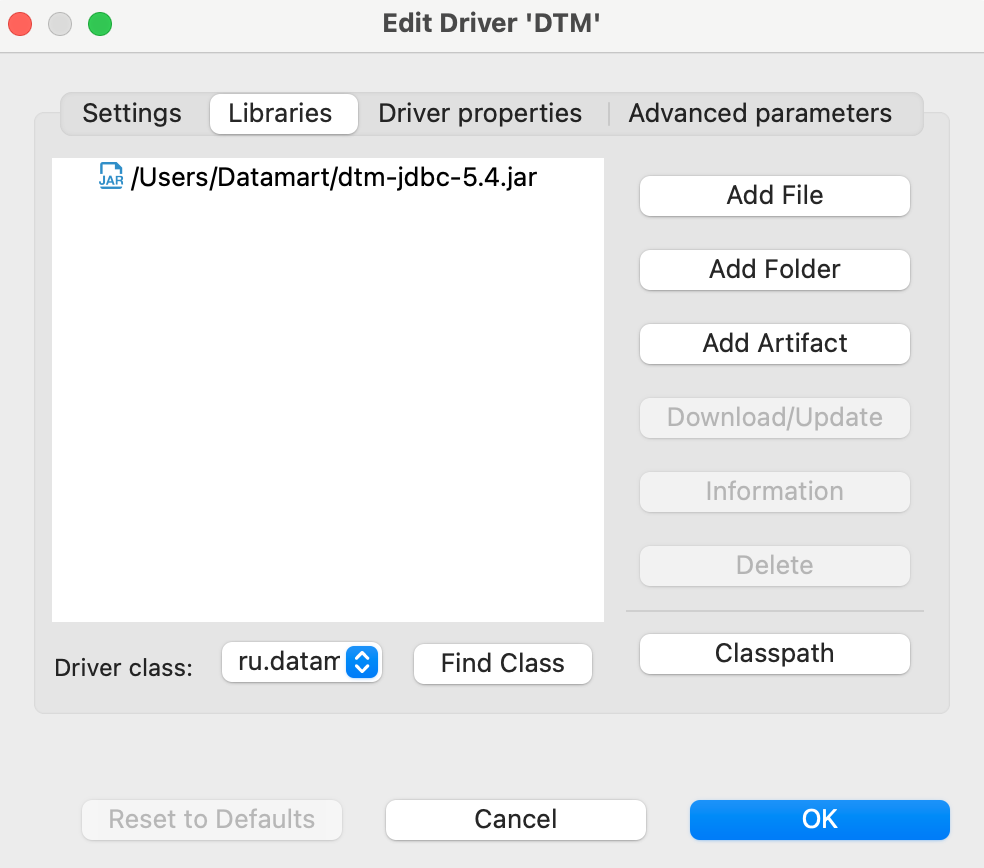
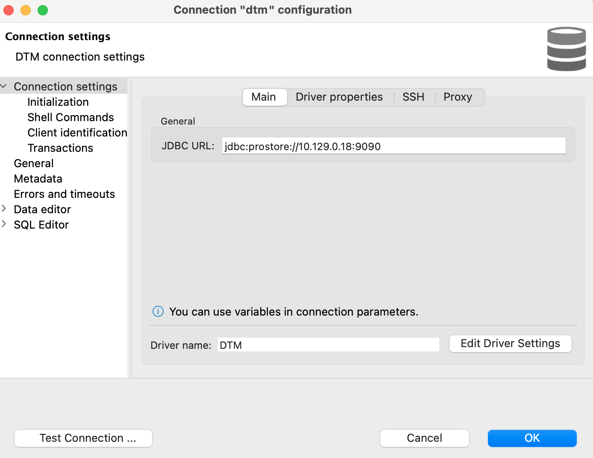

# Подключение с помощью SQL-клиента {#connection_via_sql_client}

Перед настройкой подключения загрузите скомпилированный файл драйвера с именем `dtm-jdbc-<version>.jar` 
в вашу файловую систему.

Чтобы настроить подключение к системе с помощью SQL-клиента:
1. Откройте меню, отвечающее за добавление новых JDBC-драйверов. В SQL-клиенте DBeaver это меню 
   __Driver Management__, доступное в панели __Database Navigator__, в DataGrip — меню __Data Sources__.
2. Добавьте новый драйвер со следующими настройками (см. рисунок [ниже](#img_driver_settings)):
   + __(Driver) Name__ — произвольное имя драйвера, например Prostore,
   + __(Class) Name__ — `ru.datamart.prostore.jdbc.Driver`,
   + __URL Template__ — `jdbc:prostore://{host}:{port}/{database}`,
   + __Default Port__ (если параметр присутствует) — 9090 или 9092.
3. Нажмите кнопку __Add (File)__ для добавления файла драйвера и выберите файл `dtm-jdbc-<version>.jar` 
   в вашей файловой системе.
4. Сохраните настройки драйвера.
5. Настройте новое подключение к системе с использованием добавленного JDBC-драйвера и укажите 
   URL для подключения (например, `jdbc:prostore://10.129.0.18:9092`).

После завершения настройки подключитесь к системе с помощью SQL-клиента.

На рисунках ниже показаны параметры JDBC-драйвера Prostore в SQL-клиенте DBeaver.

{:height="60%" width="60%"}
{: .figure-center}
*Параметры JDBC-драйвера*
{: .figure-caption-center}

{:height="60%" width="60%"}
{: .figure-center}
*Подключенная библиотека JDBC-драйвера*
{: .figure-caption-center}

На рисунке ниже показаны параметры подключения к системе с использованием драйвера Prostore.

{:height="90%" width="90%"}
{: .figure-center}
*Параметры подключения к системе*
{: .figure-caption-center}