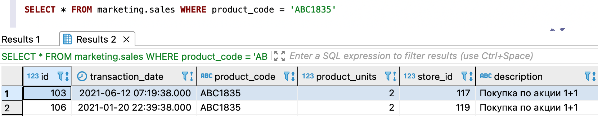

---
layout: default
title: Запрос данных
nav_order: 6
parent: Работа с системой
has_children: true
has_toc: false
---

# Запрос данных {#data_reading}
{: .no_toc }

<details markdown="block">
  <summary>
    Содержание раздела
  </summary>
  {: .text-delta }
1. TOC
{:toc}
</details>

Система позволяет запрашивать небольшие объемы данных. Данные можно запрашивать из следующих сущностей и их соединений:
* [логических таблиц](../../overview/main_concepts/logical_table/logical_table.md),
* [логических представлений](../../overview/main_concepts/logical_view/logical_view.md),
* [материализованных представлений](../../overview/main_concepts/materialized_view/materialized_view.md), 
* [standalone-таблиц](../../overview/main_concepts/standalone_table/standalone_table.md).

Под небольшим объемом данных подразумевается результат, содержащий десятки строк.
Для получения большого объема данных следует использовать [выгрузку данных](../data_download/data_download.md).
{: .note-wrapper}

Чтобы запросить данные, выполните запрос [SELECT](../../reference/sql_plus_requests/SELECT/SELECT.md). 
В запросах к логическим таблицам, логическим и материализованным представлениям можно указать СУБД хранилища 
для исполнения запроса, иначе, если СУБД не указана, система выбирает данные из 
[наиболее оптимальной СУБД](../data_reading/routing/routing.md).

На рисунке ниже показан пример запроса из логической таблицы `sales` с двумя строками в ответе.


{: .figure-center}
*Запрос небольшого объема данных*
{: .figure-caption-center}

## Примеры {#examples}

### Запрос из логической таблицы {#from_logical_table}

```sql
-- выбор логической базы данных marketing в качестве базы данных по умолчанию
USE marketing;

-- запрос данных из логической таблицы sales
SELECT s.store_id, SUM(s.product_units) AS product_amount
FROM sales AS s
GROUP BY (s.store_id)
ORDER BY product_amount DESC
LIMIT 20;
```

### Запрос из логического представления {#from_logical_view}

```sql
-- запрос данных из логического представления stores_by_sold_products
SELECT sold.store_id, sold.product_amount
FROM marketing.stores_by_sold_products AS sold;
```

### Запрос из материализованного представления {#from_matview}

```sql
-- запрос данных из материализованного представления sales_by_stores
SELECT * FROM marketing.sales_by_stores
WHERE store_id IN (1234, 1235, 1236);
```

### Запрос из standalone-таблицы {#from_standalone_table}

```sql
-- запрос данных из standalone-таблицы, на которую указывает внешняя readable-таблица payments_ext_read_adg
SELECT p.agreement_id, p.code, SUM(p.amount) AS amount, p.currency_code 
FROM marketing.payments_ext_read_adg AS p 
GROUP BY p.agreement_id, p.code, p.currency_code
```

### Запрос из соединения standalone-таблицы и логической таблицы {#from_two_type_tables}

```sql
-- запрос данных из логической таблицы clients и standalone-таблицы, на которую указывает 
--   внешняя readable-таблица agreements_ext_read_adp
SELECT a.id, a.client_id, c.last_name, c.first_name, c.patronymic_name 
FROM marketing.agreements_ext_read_adp AS a
LEFT JOIN marketing.clients FOR SYSTEM_TIME AS OF delta_num 9 AS c
  ON a.client_id = c.id
```