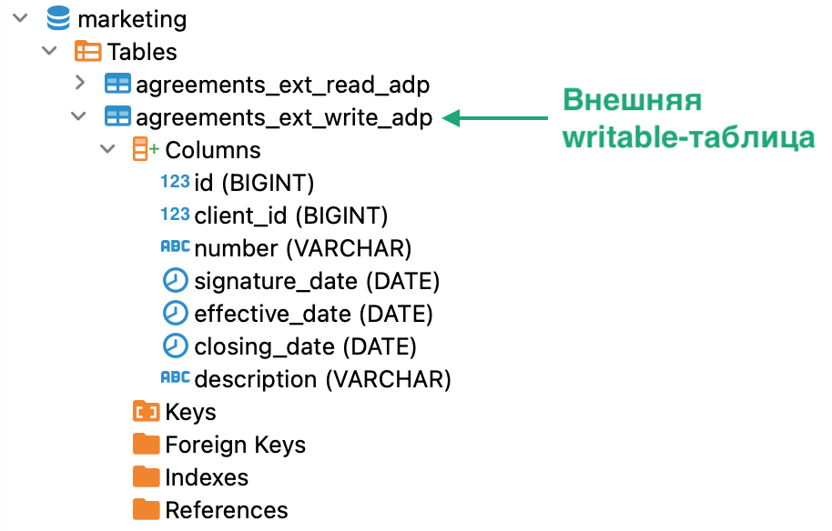

# Проверка наличия логической сущности {#entity_presence_check}
{: .no_toc }

<details markdown="block">
  <summary>
    Содержание раздела
  </summary>
  {: .text-delta }
1. TOC
{:toc}
</details>

При успешном создании логической сущности система возвращает в ответе пустой объект ResultSet, при неуспешном — исключение. 
То есть по ответу на запрос можно определить, создалась ли логическая сущность. В дальнейшем наличие сущности 
можно проверить, как описано в этом разделе.

Наличие сущности можно проверить следующими способами:
* [запросить метаданные](../request_from_schema/request_from_schema.md) из
  соответствующего [системного представления](../../../reference/system_views/system_views.md);
* выполнить [SELECT](../../../reference/sql_plus_requests/SELECT/SELECT.md)-запрос к проверяемой
  логической сущности;
* проверить дерево объектов в SQL-клиенте.

Некоторые способы проверки доступны только для некоторых типов сущностей. Подробнее о доступных способах см. в разделах
ниже по каждой сущности в отдельности.
{: .note-wrapper}

## Проверка наличия логической базы данных {#db_check}

### Проверка в системном представлении {#db_check_in_sysview}

Выполните запрос к системному представлению `schemata`, подставив вместо `DB_NAME` имя логической БД в верхнем регистре:

```sql
SELECT
  CASE
    WHEN count(*) > 0 THEN 'БД существует'
    ELSE 'БД не существует'
  END
FROM INFORMATION_SCHEMA.schemata
WHERE schema_name = '<DB_NAME>'
```

Если логическая база данных существует, в ответе возвращается строка «БД существует», иначе — строка «БД не существует».

### Проверка в дереве SQL-клиента {#db_check_in_sql_client}

Проверьте дерево объектов в вашем SQL-клиенте (см. рисунок [ниже](#img_table_in_tree)).
Если логическая база данных существует, она присутствует среди объектов в дереве SQL-клиента,
иначе — отсутствует среди объектов.

На рисунке ниже показана логическая БД в дереве объектов SQL-клиента.

<a id="img_table_in_tree"></a>
{:height="56%" width="56%"}
{: .figure-center}
*Логическая БД в дереве объектов*
{: .figure-caption-center}

## Проверка наличия логической таблицы {#table_check}

### Проверка в системном представлении {#table_check_in_sysview}

Выполните запрос к системному представлению `tables`, подставив вместо `DB_NAME` и `TABLE_NAME` имя логической БД и имя
    таблицы в верхнем регистре:

 ```sql
SELECT
  CASE
    WHEN count(*) > 0 THEN 'таблица существует'
    ELSE 'таблица не существует'
  END
FROM INFORMATION_SCHEMA.tables
WHERE table_schema = '<DB_NAME>' AND (table_name = '<TABLE_NAME>' AND table_type = 'BASE TABLE')
```

Если логическая таблица существует, в ответе возвращается строка «таблица существует», иначе — строка
«таблица не существует».

### Проверка SELECT-запросом {#table_check_in_select}

Выполните [SELECT](../../../reference/sql_plus_requests/SELECT/SELECT.md)-запрос к логической таблице, например:

```sql
SELECT * FROM <db_name>.<table_name> LIMIT 5
 ```

Если логическая таблица существует, запрос возвращает от ноля до пяти записей (в зависимости от содержимого
таблицы), иначе — исключение `Entity <table_name> does not exist`.

### Проверка в дереве SQL-клиента {#table_check_in_sql_client}

Проверьте дерево объектов в вашем SQL-клиенте (см. рисунок [ниже](#img_table_in_object_tree)). 
Если логическая таблица существует, она присутствует среди объектов логической БД в SQL-клиенте,
иначе — отсутствует среди таких объектов.

<a id="img_table_in_object_tree"></a>
{:height="52%" width="52%"}
{: .figure-center}
*Логическая таблица в дереве объектов*
{: .figure-caption-center}

## Проверка наличия логического представления {#view_check}

### Проверка в системном представлении {#view_check_in_sysview}

Выполните запрос к системному представлению `tables`, подставив вместо `DB_NAME` и `VIEW_NAME` имя логической БД и имя
логического представления в верхнем регистре:

```sql
SELECT
  CASE
    WHEN count(*) > 0 THEN 'представление существует'
    ELSE 'представление не существует'
  END
FROM INFORMATION_SCHEMA.tables
WHERE table_schema = '<DB_NAME>' AND (table_name = '<VIEW_NAME>' AND table_type = 'VIEW')
```

Если логическое представление существует, в ответе возвращается строка «представление существует», 
иначе — строка «представление не существует».

### Проверка SELECT-запросом {#view_check_in_select}

Выполните [SELECT](../../../reference/sql_plus_requests/SELECT/SELECT.md)-запрос
к логическому представлению, например:
```sql
SELECT * FROM <db_name>.<view_name> LIMIT 5
```

Если логическое представление существует, запрос возвращает от ноля до пяти записей, иначе — 
исключение `Entity <view_name> does not exist`.

### Проверка в дереве SQL-клиента {#view_check_in_sql_client}

Проверьте дерево объектов в вашем SQL-клиенте (см. рисунок [ниже](#img_view_in_object_tree)).
Если логическое представление, оно присутствует среди объектов логической БД в SQL-клиенте,
иначе — отсутствует среди объектов логической БД.

<a id="img_view_in_object_tree"></a>
{:height="62%" width="62%"}
{: .figure-center}
*Логическое представление в дереве объектов*
{: .figure-caption-center}

## Проверка наличия материализованного представления {#mat_view_check}

### Проверка в системном представлении {#matview_check_in_sysview}

Выполните запрос к системному представлению `tables`, подставив вместо `DB_NAME` и `MATERIALIZED_VIEW_NAME` 
имя логической БД и имя представления в верхнем регистре:

```sql
SELECT
  CASE
    WHEN count(*) > 1 THEN 'представление существует'
    ELSE 'представление не существует'
  END
FROM INFORMATION_SCHEMA.tables
WHERE table_schema = '<DB_NAME>' AND
      (table_name = '<MATERIALIZED_VIEW_NAME>' AND table_type = 'MATERIALIZED VIEW')
```

Если материализованное представление существует, в ответе возвращается строка «представление существует»,
иначе — строка «представление не существует».

### Проверка SELECT-запросом {#matview_check_in_select}

Выполните [SELECT](../../../reference/sql_plus_requests/SELECT/SELECT.md)-запрос к материализованному
представлению, например:
```sql
SELECT * FROM <db_name>.<materialized_view_name> LIMIT 5
```

Если материализованное представление существует, запрос возвращает от ноля до пяти записей, иначе — 
исключение `Entity <materialized_view_name> does not exist`.

### Проверка в дереве SQL-клиента {#matview_check_in_sql_client}

Проверьте дерево объектов в вашем SQL-клиенте (см. рисунок [ниже](#img_mat_view_in_object_tree)).
Если материализованное представление существует, оно присутствует среди объектов логической БД в SQL-клиенте,
иначе — отсутствует среди объектов логической БД.

<a id="img_mat_view_in_object_tree"></a>
{:height="60%" width="60%"}
{: .figure-center}
*Материализованное представление в дереве объектов*
{: .figure-caption-center}

## Проверка наличия внешней таблицы загрузки или выгрузки {#ext_table_check}

Наличие внешних таблиц загрузки и выгрузки можно проверить только в дереве объектов
SQL-клиента. Внешние таблицы не отображаются в системных представлениях, и для них недоступны SELECT-запросы.

Если внешняя таблица существует, она присутствует среди
объектов логической БД в дереве SQL-клиента, иначе — отсутствует среди объектов логической БД.

На рисунках ниже показаны фрагменты дерева объектов SQL-клиента: с внешней таблицей загрузки `sales_ext_upload` 
и внешней таблицей выгрузки `sales_ext_download` соответственно.

<a id="img_upload_table_in_tree"></a>
{:height="66%" width="66%"}
{: .figure-center}
*Внешняя таблица загрузки в дереве объектов*
{: .figure-caption-center}

<a id="img_download_table_in_tree"></a>
{:height="60%" width="60%"}
{: .figure-center}
*Внешняя таблица выгрузки в дереве объектов*
{: .figure-caption-center}

## Проверка наличия внешней readable-таблицы {#readable_table_check}

### Проверка в системном представлении {#readable_table_check_in_sysview}

Выполните запрос к системному представлению `tables`, подставив вместо `DB_NAME` и `TABLE_NAME` имя логической БД и имя
таблицы в верхнем регистре:

 ```sql
SELECT
  CASE
    WHEN count(*) > 0 THEN 'таблица существует'
    ELSE 'таблица не существует'
  END
FROM INFORMATION_SCHEMA.tables
WHERE table_schema = '<DB_NAME>' AND (table_name = '<TABLE_NAME>' AND table_type = 'READABLE EXTERNAL TABLE')
```

Если таблица существует, в ответе возвращается строка «таблица существует», иначе — строка
«таблица не существует».

### Проверка SELECT-запросом {#readable_table_check_in_select}

Выполните [SELECT](../../../reference/sql_plus_requests/SELECT/SELECT.md)-запрос к readable-таблице, например:

```sql
SELECT * FROM <db_name>.<table_name> LIMIT 5
 ```

Если таблица существует, запрос возвращает от ноля до пяти записей (в зависимости от содержимого
таблицы), иначе — исключение `Entity <table_name> does not exist`.

### Проверка в дереве SQL-клиента {#readable_table_check_in_sql_client}

Проверьте дерево объектов в вашем SQL-клиенте (см. рисунок [ниже](#img_readable_table_in_object_tree)).
Если таблица существует, она присутствует среди объектов логической БД в SQL-клиенте,
иначе — отсутствует среди таких объектов.

<a id="img_readable_table_in_object_tree"></a>
{:height="60%" width="60%"}
{: .figure-center}
*Внешняя readable-таблица в дереве объектов*
{: .figure-caption-center}

## Проверка наличия внешней writable-таблицы {#writable_table_check}

### Проверка в системном представлении {#writable_table_check_in_sysview}

Выполните запрос к системному представлению `tables`, подставив вместо `DB_NAME` и `TABLE_NAME` имя логической БД и имя
таблицы в верхнем регистре:

 ```sql
SELECT
  CASE
    WHEN count(*) > 0 THEN 'таблица существует'
    ELSE 'таблица не существует'
  END
FROM INFORMATION_SCHEMA.tables
WHERE table_schema = '<DB_NAME>' AND (table_name = '<TABLE_NAME>' AND table_type = 'WRITABLE EXTERNAL TABLE')
```

Если таблица существует, в ответе возвращается строка «таблица существует», иначе — строка
«таблица не существует».

### Проверка в дереве SQL-клиента {#writable_table_check_in_sql_client}

Проверьте дерево объектов в вашем SQL-клиенте (см. рисунок [ниже](#img_writable_table_in_object_tree)).
Если таблица существует, она присутствует среди объектов логической БД в SQL-клиенте,
иначе — отсутствует среди таких объектов.

<a id="img_writable_table_in_object_tree"></a>
{:height="60%" width="60%"}
{: .figure-center}
*Внешняя writable-таблица в дереве объектов*
{: .figure-caption-center}