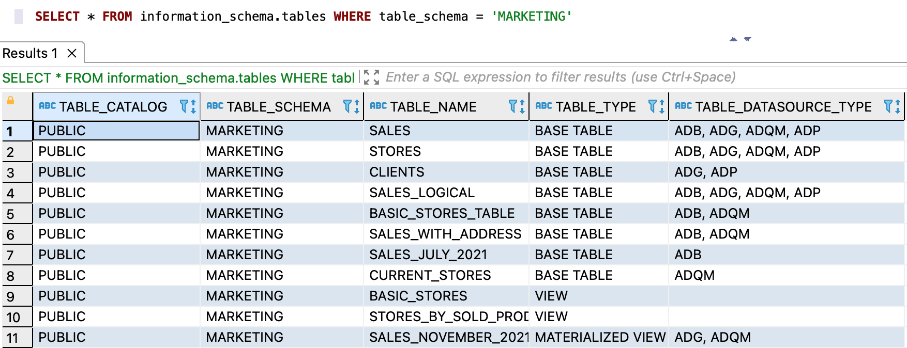

---
layout: default
title: Проверка месторасположения логической сущности
nav_order: 3
parent: Другие действия
grand_parent: Работа с системой
has_children: false
has_toc: false
---

# Проверка месторасположения логической сущности {#datasource_check}

Чтобы проверить, в каких [СУБД](../../../introduction/supported_DBMS/supported_DBMS.md)
[хранилища](../../../overview/main_concepts/data_storage/data_storage.md) размещены данные логической сущности, 
выполните запрос к системному представлению [tables](../../../reference/system_views/system_views.md#tables) 
(где вместо `DB_NAME` и `ENTITY_NAME` подставьте имя [логической базы данных](../../../overview/main_concepts/logical_db/logical_db.md) 
и имя логической сущности в верхнем регистре):
* запрос для [логической таблицы](../../../overview/main_concepts/logical_table/logical_table.md):
```sql
SELECT * FROM information_schema.tables
WHERE table_schema = '<DB_NAME>' AND (table_name = '<ENTITY_NAME>' AND table_type = 'BASE TABLE')
```
* запрос для [материализованного представления](../../../overview/main_concepts/materialized_view/materialized_view.md):
```sql
SELECT * FROM information_schema.tables
WHERE table_schema = '<DB_NAME>' AND (table_name = '<ENTITY_NAME>' AND table_type = 'MATERIALIZED VIEW')
```
* запрос для [внешней readable-таблицы](../../../overview/main_concepts/external_table/external_table.md#readable_table):
```sql
SELECT * FROM information_schema.tables
WHERE table_schema = '<DB_NAME>' AND (table_name = '<ENTITY_NAME>' AND table_type = 'READABLE EXTERNAL TABLE')
```
* запрос для [внешней writable-таблицы](../../../overview/main_concepts/external_table/external_table.md##writable_table):
```sql
SELECT * FROM information_schema.tables
WHERE table_schema = '<DB_NAME>' AND (table_name = '<ENTITY_NAME>' AND table_type = 'WRITABLE EXTERNAL TABLE')
```

В ответе система возвращает информацию о запрошенной логической сущности, где столбец `table_datasource_type` 
содержит список СУБД хранилища, в которых размещены данные логической сущности.

На рисунке ниже показан пример запроса по логическим сущностям логической БД `marketing` без фильтрации по типам сущностей.

<a id="img_datasource_check"></a>

{: .figure-center}
*Системное представление tables*
{: .figure-caption-center}